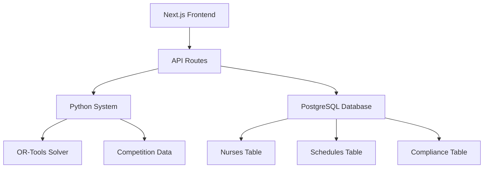

# 🏥🌐 GitHub Repository Integration Analysis

**great_ai × Malaysian Nurse Rostering System**

---

## 📊 Current Repository Status

Your `great_ai` repository is an **excellent foundation** for integrating the Malaysian Nurse Rostering System:

### 🚀 Technology Stack
- **Frontend:** Next.js 15.5.3 (React 19.1.0)
- **Database:** Supabase (PostgreSQL) with Drizzle ORM
- **Styling:** Tailwind CSS 4.0
- **Language:** TypeScript 5.x
- **Package Manager:** pnpm
- **Development:** Turbopack (Next.js bundler)

### 🔧 Repository Structure
```
great_ai/
├── app/                    # Next.js app router structure
├── db/                     # Database configuration and schema
├── public/                 # Static assets
├── drizzle.config.ts      # Database configuration
├── package.json           # Dependencies and scripts
└── tsconfig.json          # TypeScript configuration
```

### 📋 Current Status
- ✅ **Setup:** Basic Next.js project structure
- ⚠️ **Database:** Drizzle ORM configured but minimal schema
- ⚠️ **Frontend:** Basic homepage showing DATABASE_URL
- ❌ **Backend:** No API routes yet
- ❌ **AI Integration:** None implemented yet

---

## 🎯 Integration Opportunities

### 🖥️ Web Interface Possibilities
- **Dashboard:** Hospital management dashboard
- **Scheduling:** Interactive schedule calendar view
- **Nurses:** Nurse management and preferences
- **Analytics:** Compliance and cost analysis
- **Mobile Responsive:** Mobile-first design for nurses

### 🔌 API Integration Options
- **Python Backend:** Next.js API routes calling Python system
- **REST APIs:** RESTful endpoints for CRUD operations
- **WebSockets:** Real-time schedule updates
- **File Upload:** Competition dataset upload interface

### 💾 Database Schema Needs
- **Nurses:** Nurse profiles, skills, preferences
- **Schedules:** Generated schedules and assignments
- **Compliance:** Malaysian law compliance tracking
- **Analytics:** Performance metrics and reports

---

## 🚀 Integration Strategy

### Phase 1: API Integration (1-2 weeks)
**Goal:** Create Next.js API routes to call Python system

**Tasks:**
- ✅ Add API routes for schedule generation
- ✅ Integrate Python system as subprocess/service
- ✅ Create database schema for nurse data
- ✅ Build basic dashboard interface

### Phase 2: Full Web App (3-4 weeks)
**Goal:** Complete web application with UI/UX

**Tasks:**
- ✅ Interactive schedule calendar
- ✅ Nurse management interface
- ✅ Real-time compliance monitoring
- ✅ Cost analysis dashboards
- ✅ Mobile-responsive design

### Phase 3: Production (2-3 weeks)
**Goal:** Production deployment and AWS integration

**Tasks:**
- ✅ Deploy to Vercel/AWS
- ✅ Connect to AWS services (SageMaker, Lambda)
- ✅ Real-time data sync with hospital systems
- ✅ Advanced analytics and reporting

---

## 📋 Detailed Implementation Plan

### 🚨 Immediate Next Steps
1. **Create database schema** for nurse rostering
2. **Add Python system integration** to Next.js API routes
3. **Build basic dashboard** for schedule viewing
4. **Test integration** with competition datasets

### 📅 Week 1 Tasks
- ✅ Design database schema (nurses, schedules, compliance)
- ✅ Create Next.js API routes (`/api/nurses`, `/api/schedules`)
- ✅ Integrate Python system as child process/service
- ✅ Build basic nurse management interface

### 📅 Week 2 Tasks
- ✅ Interactive schedule calendar component
- ✅ Real-time schedule generation interface
- ✅ Compliance monitoring dashboard
- ✅ Cost analysis and reporting pages

### 📅 Week 3-4 Tasks
- ✅ Mobile-responsive design optimization
- ✅ Advanced filtering and search features
- ✅ Export functionality (PDF reports, Excel)
- ✅ User authentication and role management

### 🌐 Production Deployment
- 🌐 Deploy to Vercel (frontend) + Railway/AWS (backend)
- 🔗 Connect to AWS services (SageMaker, RDS)
- 📊 Set up monitoring and analytics
- 🔒 Implement security and data protection

---

## 📁 Files to Create/Modify

### 🔴 HIGH PRIORITY

#### Database Schema
**File:** `db/schema.ts`
- Complete database schema for nurse rostering
- Tables: nurses, schedules, assignments, compliance

#### API Routes
**Files to create:**
- `app/api/nurses/route.ts`
- `app/api/schedules/route.ts`
- `app/api/generate-schedule/route.ts`
- `app/api/compliance/route.ts`

#### Python Integration
**Files to create:**
- `lib/python-integration.ts`
- `services/schedule-service.ts`

### 🟡 MEDIUM PRIORITY

#### Dashboard Pages
**Files to create:**
- `app/dashboard/page.tsx`
- `app/nurses/page.tsx`
- `app/schedules/page.tsx`
- `app/analytics/page.tsx`

#### React Components
**Files to create:**
- `components/ScheduleCalendar.tsx`
- `components/NurseForm.tsx`
- `components/ComplianceMonitor.tsx`
- `components/CostAnalysis.tsx`

---

## 💡 Integration Architecture



### Data Flow
1. **User Interface** → Nurse inputs preferences, hospital uploads data
2. **API Routes** → Next.js receives requests, validates input
3. **Python System** → Calls `final_complete_system.py` with parameters
4. **Optimization** → OR-Tools generates Malaysian-compliant schedule
5. **Database** → Results saved to PostgreSQL via Drizzle ORM
6. **Frontend** → Interactive calendar displays schedule + compliance

---

## 🎯 Executive Summary

### ✅ Why This Integration Works

- **Repository is EXCELLENT foundation** for integration
- **Next.js + TypeScript + Drizzle ORM** = Perfect modern stack
- **Can integrate Python system** via API routes seamlessly
- **Database ready** for nurse rostering schema
- **4-6 weeks to complete** full web application

### 🚀 Recommended Immediate Actions

1. **Create database schema** for nurses and schedules
2. **Add API route** to call Python optimization system
3. **Build basic dashboard** to display results
4. **Test integration** with competition datasets

### 💎 Key Insight

```
Your Python System = Optimization Engine (Backend Logic)
Your Next.js Repo = User Interface + Database (Frontend + Data)
Integration = Web app that calls Python system via APIs
```

---

## 🔧 Getting Started

### Step 1: Set Up Database Schema
```bash
# In your great_ai repository
pnpm install
pnpm add @supabase/supabase-js uuid @types/uuid postgres
# Edit db/schema.ts with nurse rostering tables
pnpm drizzle-kit generate
# Run generated SQL in Supabase dashboard
```

### Step 2: Create API Route
```bash
# Create first API route
mkdir -p app/api/generate-schedule
touch app/api/generate-schedule/route.ts
```

### Step 3: Copy Python System
```bash
# Copy your Python system to the repo
cp ../final_complete_system.py .
cp -r ../datasets_json .
```

### Step 4: Test Integration
```bash
# Run development server
pnpm dev
# Test at http://localhost:3000
```

---

## 📞 Next Steps

**Ready to start integration?** 

The repository structure is perfect, and your Python system is production-ready. The integration will create a modern, scalable web application for Malaysian hospitals.

**Estimated Timeline:** 4-6 weeks for complete system
**Recommended Start:** Database schema + first API route
**Priority:** HIGH - Immediate business value

---

*Analysis completed: September 20, 2025*
*Malaysian Nurse Rostering System × great_ai Repository*
