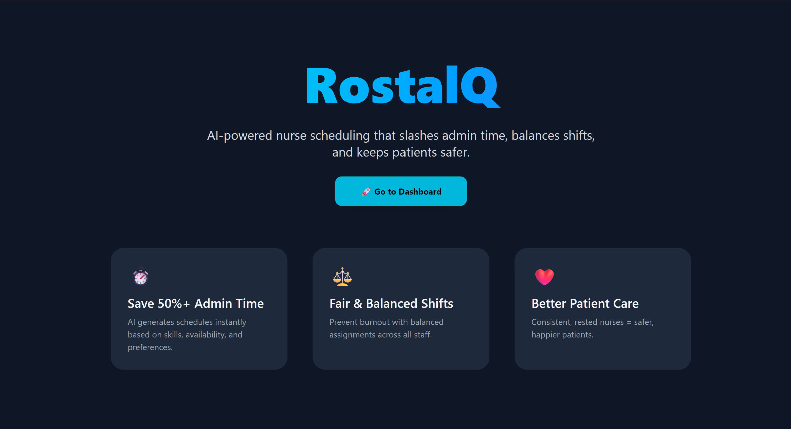
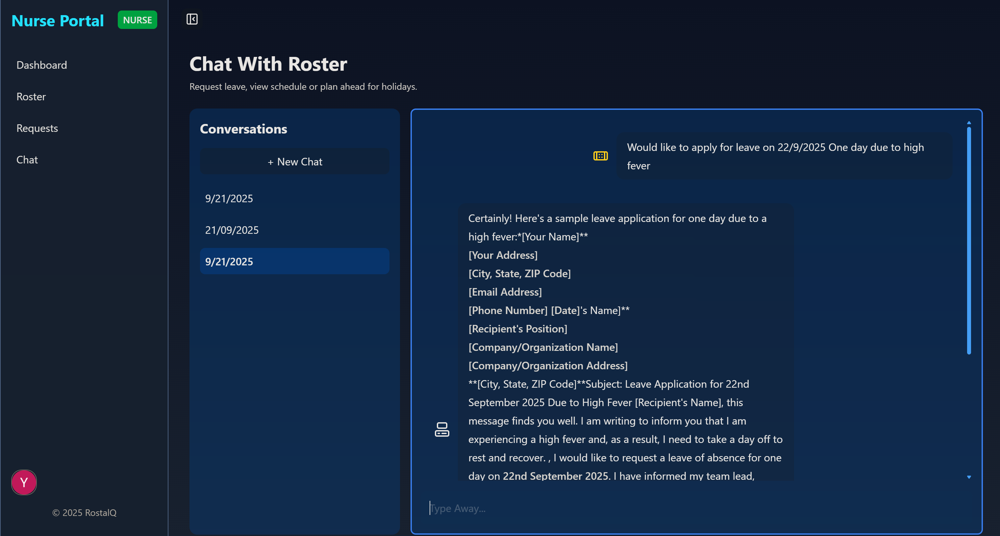
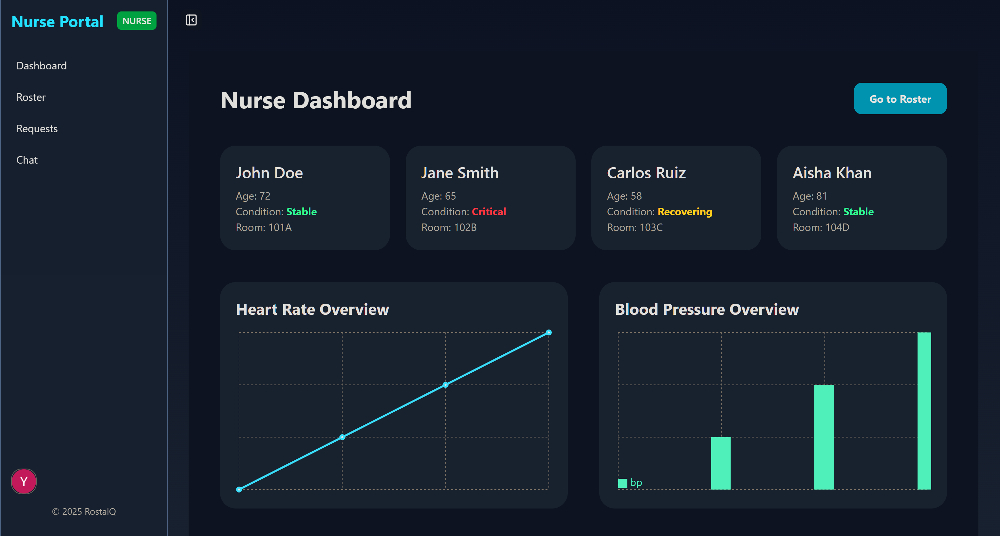

# RostalQ - AI-Powered Nurse Rostering System



RostalQ is an intelligent, automated nurse scheduling system designed to optimize hospital workforce management. Built with a modern tech stack, it leverages AI and machine learning to forecast staffing needs and generate fair, compliant, and preference-aware weekly rosters.

---

## Table of Contents

- [Features](#features)
- [System Architecture](#system-architecture)
- [Technology Stack](#technology-stack)
- [AWS Services Utilized](#aws-services-utilized)
- [Application Routes](#application-routes)
  - [Admin Routes](#admin-routes)
  - [Nurse Routes](#nurse-routes)
- [Getting Started](#getting-started)
  - [Prerequisites](#prerequisites)
  - [Installation](#installation)
  - [Environment Variables](#environment-variables)
  - [Running the Application](#running-the-application)
- [License](#license)

---

## Features

- **AI-Powered Demand Forecasting:** Predicts the required number of nurses for the upcoming week using an XGBoost model trained on historical health data.
- **Constraint-Based Roster Generation:** Utilizes Google OR-Tools to create optimized schedules that respect legal requirements, hospital policies, and individual nurse preferences.
- **Role-Based Access Control:** Separate, dedicated dashboards and functionalities for Admins (HR) and Nurses.
- **Dynamic Roster Management:** Admins can generate, review, and select the most suitable roster from a list of valid options.
- **Nurse Self-Service Portal:** Nurses can view their schedules, manage preferences, and request leave.
- **AI-Assistant Chatbot:** An integrated chatbot powered by AWS Bedrock allows nurses to interact with the system conversationally to perform actions like requesting leave or reporting emergencies.

---

## Core Engine: The Roster Generation Process

RosterQ's innovation lies in its two-part automated scheduling engine. It first predicts demand and then generates optimized rosters that satisfy a complex set of rules.


### Part 1: Predictive Demand Forecasting

This system provides a crucial input for the roster: an estimated number of nurses (`N`) required for the upcoming week.

- **Algorithm:** We use **XGBoost**, a powerful gradient boosting algorithm, which is a form of supervised machine learning.
- **Training Data:** The model is trained on cleaned influenza case data provided by the World Health Organization (WHO). This allows the system to learn seasonal and weekly patterns in patient admission rates.
- **Infrastructure:**
    - **AWS SageMaker:** Used to train and tune the XGBoost model.
    - **AWS Lambda:** The trained model is deployed as a serverless function. This creates a highly available, low-cost endpoint that the application can query at any time to get a prediction for a specific date range.
- **Output:** The model's sole output is `N`, the predicted number of nurses required. This number serves as a **hard constraint** for the next stage.

### Part 2: Constraint-Based Roster Generation

This is where the actual schedules are created. Using the predicted demand `N`, this system finds a legitimate subset of all possible schedules that meet hospital and nurse requirements.

- **Algorithm:** We use **Google OR-Tools**, a powerful open-source software suite for combinatorial optimization, specifically its Constraint Programming (CP-SAT) solver.
- **Infrastructure:** The CP-SAT solver is hosted on **AWS Lambda** (or **AWS Fargate** for more complex, longer-running tasks). This allows the main application to offload the computationally intensive task of schedule generation.
- **Model Inputs:**
    1.  **Predicted Demand (N):** The hard constraint from the predictive model.
    2.  **Nurse Dataset:** A comprehensive dataset simulating real nurse data, including seniority (based on tenure), skills, and availability.
    3.  **Nurse Preferences:** A table containing individual preferences for each nurse, such as desired shift types (day/night) or lengths (8/12 hours).
    4.  **Hospital Roster Requirements:** The overall staffing needs for all shifts across the hospital for the week.

---

#### Hard Constraints (Mandatory Rules)

These are rules that the generated roster **must** obey at all times.

- **Maximum Weekly Hours:** 40-45 hours per nurse.
- **Maximum Weekly Shifts:** 4-5 shifts per nurse.
- **Rest Periods:** Shifts cannot be scheduled immediately next to one another.
- **Daily Breaks:** Each shift must include a 1-hour break.
- **Shift Length:** Individual shifts can range from 8 to 12 hours.

#### Soft Constraints (Nurse Preferences)

These are "nice-to-have" variables that the system tries to satisfy. They contribute to a higher-quality roster but are not strictly mandatory.

- **Preferred Days Off:** Nurses can request two preferred days off, represented by an integer (e.g., 0 for Sunday, 1 for Monday).
- **Shift Type:** A binary preference for day or night shifts.

---

### Part 3: AI-Powered Nurse Assistant

To streamline communication and administrative tasks, RosterQ integrates a sophisticated AI chatbot, turning complex actions into simple conversations.

- **Technology:** The chat interface is powered by **AWS Bedrock**, which provides access to powerful foundation models (e.g., Claude, Llama). This allows for natural language understanding and task execution.
- **Database Integration:** The assistant is connected to the application's database, giving it secure, real-time access to nurse records, credentials, and current schedules.
- **Core Capabilities:**
    - **Perform Actions:** Nurses can perform tasks like "apply for leave for next Monday" or "report sick for my shift today" conversationally.
    - **Query Information:** The chatbot can answer questions about a nurse's schedule, remaining leave, or other personal data.
    - **Dynamic Re-Rostering:** When an emergency is reported (e.g., a nurse calling in sick), the chatbot can automatically trigger a new roster generation run. It updates the nurse's availability in the database and invokes the Constraint Programming engine to generate a revised, valid schedule for the admin to approve.



---

## End-to-End Workflow: From Admin to Nurse

1.  **View Active Staff:** The HR Admin logs in and can view all currently active and available nurses.
2.  **Initiate Roster Generation:** The admin requests a new schedule for the upcoming week.
3.  **Backend Orchestration:**
    - The backend first calls the **Predictive Model Lambda** to get the predicted number of nurses (`N`).
    - It then calls the **Constraint Programming Lambda/Fargate** endpoint, passing `N` along with all nurse data, preferences, and hospital requirements.
4.  **Receive Solutions:** The CP model returns all valid roster schedules that satisfy the constraints.
5.  **Admin Selection:** The admin reviews the generated options on the frontend and selects the most suitable one.
6.  **Save and Notify:** The backend saves the selected roster to the database. Nurses are then able to see their new schedule on their dashboard.

---

## Technology Stack

- **Frontend:** [Next.js 15](https://nextjs.org/), [React](https://reactjs.org/), [Tailwind CSS](https://tailwindcss.com/), [Framer Motion](https://www.framer.com/motion/)
- **Backend:** Next.js API Routes, TypeScript
- **Database:** (Please specify your database, e.g., PostgreSQL, MySQL, DynamoDB)
- **AI/ML:** [Google OR-Tools](https://developers.google.com/optimization), [XGBoost](https://xgboost.ai/)
- **Deployment:** Vercel (for Next.js App), AWS

---

## AWS Services Utilized

- **AWS SageMaker:** Used for training the XGBoost machine learning model for nurse demand forecasting.
- **AWS Amplify:** Serverless hosting for our Next Js 15 website. Able to scale when needed and on demand
- **AWS Lambda:** Hosts both the predictive model endpoint and the constraint programming (Google OR-Tools) model, providing serverless, on-demand compute.
- **AWS Bedrock:** Powers the conversational AI chatbot, enabling nurses to perform actions through a natural language interface.
- **Note on Scalability:** For extremely complex rostering scenarios that might exceed Lambda's execution time limits, the CP model can be containerized and deployed on **AWS Fargate** for more robust, long-running task handling.

---

## Application Routes

RostalQ features distinct routes for its two primary user roles: Admin and Nurse.

### Admin Routes

The admin portal is designed for managing the nursing staff and generating schedules.

- `/admin/dashboard`: Main dashboard for an overview of operations.
- `/admin/roster`: Interface to generate, view, and approve weekly rosters.
- `/admin/requests`: View and manage leave requests from nurses.


### Nurse Routes

The nurse portal is focused on personal schedule management and communication.

- `/nurse/dashboard`: View personal weekly schedules and important notifications.
- `/nurse/roster`: A detailed view of the personal roster.
- `/nurse/requests`: Submit and track leave requests.
- `/nurse/chat`: Interact with the AI assistant for tasks like requesting leave or reporting an emergency. In case of an emergency (e.g., calling in sick), the chatbot can trigger a re-rostering process by updating the nurse's availability and initiating a new run of the CP model.



---

## Getting Started

Follow these instructions to set up and run the project locally.

### Prerequisites

- [Node.js](https://nodejs.org/en/) (v22 or later)
- [pnpm](https://pnpm.io/installation)
- [AWS CLI](https://aws.amazon.com/cli/), configured with your credentials

### Installation

1.  **Clone the repository:**
    ```bash
    git clone https://github.com/your-username/RosterQ.git
    cd RosterQ
    ```

2.  **Install dependencies:**
    ```bash
    pnpm install
    ```

### Environment Variables

Create a `.env.local` file in the root of the project and add the necessary environment variables.

```env
# Example .env.local

# AWS Credentials (ensure your CLI is configured or provide them here)
AWS_ACCESS_KEY_ID=YOUR_AWS_ACCESS_KEY
AWS_SECRET_ACCESS_KEY=YOUR_AWS_SECRET_KEY
AWS_REGION=YOUR_AWS_REGION

# API Endpoints
PREDICTIVE_MODEL_LAMBDA_URL=URL_TO_YOUR_SAGEMAKER_ENDPOINT_LAMBDA
CP_MODEL_LAMBDA_URL=URL_TO_YOUR_OR_TOOLS_LAMBDA

# Database Connection
DATABASE_URL="your_database_connection_string"

# NextAuth.js (if using for authentication)
NEXTAUTH_URL=http://localhost:3000
NEXTAUTH_SECRET=a_random_secret_string
```

### Running the Application

Start the development server:

```bash
pnpm dev
```

Open [http://localhost:3000](http://localhost:3000) in your browser to see the application.

---

## License

This project is licensed under the MIT License. See the `LICENSE` file for details.